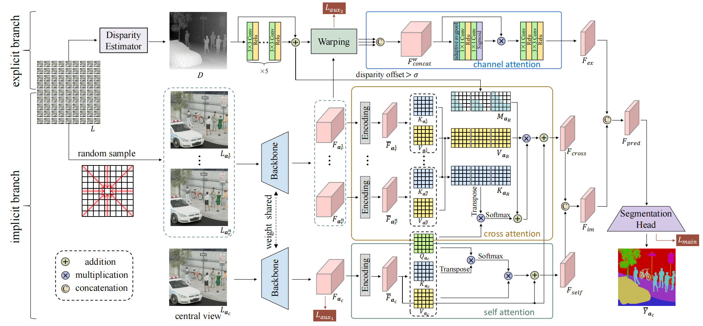
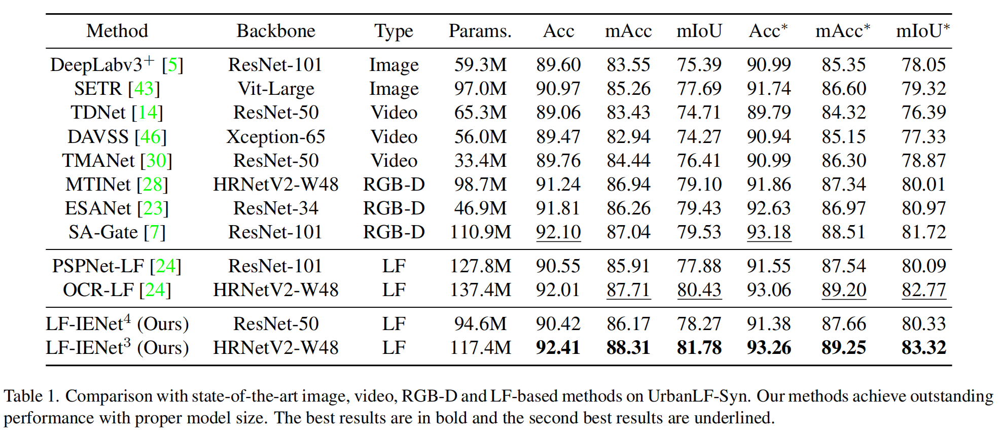
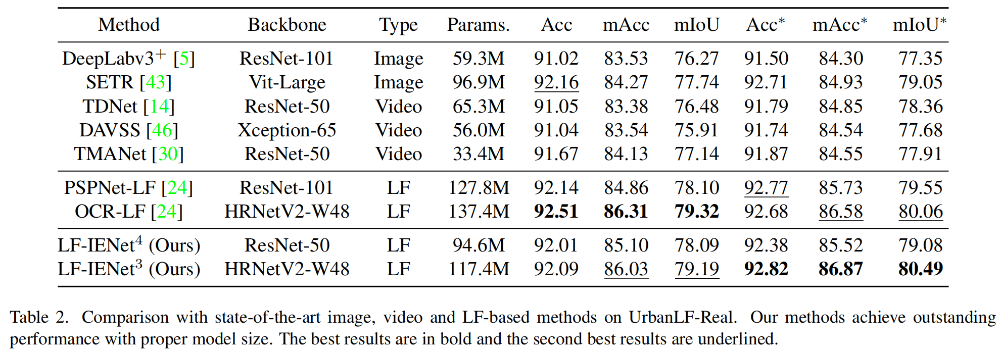

# LF-IENet

This is the official pytorch implementation repository of [Combining Implicit-Explicit View Correlation for Light Field Semantic Segmentation.](https://openaccess.thecvf.com/content/CVPR2023/html/Cong_Combining_Implicit-Explicit_View_Correlation_for_Light_Field_Semantic_Segmentation_CVPR_2023_paper.html) (CVPR 2023)

## Introduction

We propose a novel network called **LF-IENet** for **light field semantic segmentation**. It contains two different manners to mine complementary information from surrounding views to segment central view. One is **implicit feature integration** that leverages attention mechanism to compute inter-view and intra-view similarity to modulate features of central view. The other is **explicit feature propagation** that directly warps features of other views to central view under the guidance of disparity. They complement each other and jointly realize complementary information fusion across views in light field.



## Results





## Code

This repository is implemented with the open source [mmsegmentation toolbox](https://github.com/open-mmlab/mmsegmentation) and disparity estimator [OAVC](https://github.com/imkanghan/OAVC).

### Dependencies

- `pytorch` 1.8.0 + `torchvision` 0.9.0 + `mmcv` 1.6.2 + `cuda` 10.2 + `python` 3.8.10

### Training and Test Data

1. Please refer to [UrbanLF](https://github.com/HAWKEYE-Group/UrbanLF) for `UrbanLF-Real` dataset and `UrbanLF-Syn` dataset.

2. Get predict disparity result generated by [OAVC](https://github.com/imkanghan/OAVC).

   ```xshell
   cd OAVC
   python main.py
   ```

3. The final datasets store on `./data/UrbanLF/UrbanLF_Real` and `./data/UrbanLF/UrbanLF_Syn` path. The file structure of dataset is as followed.

   ```
   ├── data                                              ├── data                              
   │   ├── UrbanLF_Real                                  │   ├── UrbanLF_Syn                       
   │   │   ├── train                                     │   │   ├── train  
   │   │   │   ├── Imagexxx                              │   │   │   ├── Imagexxx       
   │   │   │   │   ├── u_v.png(1_1.png~9_9.png)          │   │   │   |   ├── u_v.png(1_1.png~9_9.png)       
   │   │   │   │   ├── label.npy                         │   │   │   |   ├── 5_5_label.npy     
   │   │   │   │   ├── disparity_OAVC.npy                │   │   |   |   ├── 5_5_disparity_OAVC.npy               
   │   │   │   ├── Imageyyy                              │   │   │   ├── Imageyyy   
   |   |   |   ├── Imagezzz                              │   │   │   ├── Imagezzz
   │   │   ├── val                                       │   │   ├── val               
   │   │   │   ├── Imagexxx                              │   │   │   ├── Imagexxx              
   │   │   │   │   ├── u_v.png(1_1.png~9_9.png)          │   │   |   |   ├── u_v.png(1_1.png~9_9.png)                    
   │   │   │   │   ├── label.npy                         │   │   │   |   ├── 5_5_label.npy   
   │   │   │   │   ├── disparity_OAVC.npy                │   │   │   |   ├── 5_5_disparity_OAVC.npy   
   │   │   │   ├── Imageyyy                              │   │   │   ├── Imageyyy   
   |   |   |   ├── Imagezzz                              |   |   |   ├── Imagezzz
   │   │   ├── test                                      │   │   ├── test            
   │   │   │   ├── Imagexxx                              │   │   │   ├── Imagexxx   
   │   │   │   │   ├── u_v.png(1_1.png~9_9.png)          │   │   │   |   ├── u_v.png(1_1.png~9_9.png)  
   │   │   │   │   ├── disparity_OAVC.npy                |   │   │   │   ├── 5_5_disparity_OAVC.npy             
   │   │   │   ├── Imageyyy                              │   │   │   ├── Imageyyy                            
   |   |   |   ├── Imagezzz                              │   │   │   ├── Imagezzz 
   ```

### Train

- Train `LF-IENet`$^{4}$`-Res50` on `UrbanLF-Real` dataset.  

```shell
CUDA_VISIBLE_DEVICES='0,1' python -m torch.distributed.launch --nproc_per_node 2 --master_port 1123  train.py configs/lf/UrbanLF_Real/LF_IENet_r50-d8_432x432_80k_UrbanLF_Real.py --launcher 'pytorch' 
```

- Train `LF-IENet`$^{3}$`-HR48` on `UrbanLF-Real` dataset.  

```shell
CUDA_VISIBLE_DEVICES='0,1' python -m torch.distributed.launch --nproc_per_node 2 --master_port 1123  train.py configs/lf/UrbanLF_Real/LF_IENet_hr48_432x432_80k_UrbanLF_Real.py --launcher 'pytorch'
```

- Train `LF-IENet`$^{4}$`-Res50` on `UrbanLF-Syn` dataset.  

```shell
CUDA_VISIBLE_DEVICES='0,1' python -m torch.distributed.launch --nproc_per_node 2 --master_port 1123  train.py configs/lf/UrbanLF_Syn/LF_IENet_r50-d8_480x480_80k_UrbanLF_Syn.py --launcher 'pytorch' 
```

- Train `LF-IENet`$^{3}$`-HR48` on `UrbanLF-Syn` dataset.   

```shell
CUDA_VISIBLE_DEVICES='0,1' python -m torch.distributed.launch --nproc_per_node 2 --master_port 1123  train.py configs/lf/UrbanLF_Syn/LF_IENet_hr48_480x480_80k_UrbanLF_Syn.py --launcher 'pytorch' 
```

### Test

- Test `LF-IENet`$^{4}$`-Res50` on `UrbanLF-Real` dataset.  

```shell
CUDA_VISIBLE_DEVICES='0' python test.py configs/lf/UrbanLF_Real/LF_IENet_r50-d8_432x432_80k_UrbanLF_Real.py work_dirs/LF_IENet_r50-d8_432x432_80k_UrbanLF_Real/best_mIoU.pth --show-dir img_res 
```

- Test `LF-IENet`$^{3}$`-HR48` on `UrbanLF-Real` dataset.  

```SHELL
CUDA_VISIBLE_DEVICES='0' python test.py configs/lf/UrbanLF_Real/LF_IENet_hr48_432x432_80k_UrbanLF_Real.py work_dirs/LF_IENet_hr48_432x432_80k_UrbanLF_Real/best_mIoU.pth --show-dir img_res 
```

- Test `LF-IENet`$^{4}$`-Res50` on `UrbanLF-Syn` dataset.  

```shell
CUDA_VISIBLE_DEVICES='0' python test.py configs/lf/UrbanLF_Syn/LF_IENet_r50-d8_480x480_80k_UrbanLF_Syn.py work_dirs/LF_IENet_r50-d8_480x480_80k_UrbanLF_Syn/best_mIoU.pth --show-dir img_res
```

- Test `LF-IENet`$^{3}$`-HR48` on `UrbanLF-Syn` dataset.  

```shell
CUDA_VISIBLE_DEVICES='0' python test.py configs/lf/UrbanLF_Syn/LF_IENet_hr48_480x480_80k_UrbanLF_Syn.py work_dirs/LF_IENet_hr48_480x480_80k_UrbanLF_Syn/best_mIoU.pth --show-dir img_res
```

- The predict segmentation result will be saved in `numpy_res/real (UrbanLF-Real)` and `numpy_res/syn (UrbanLF-Syn)`.

  The qualitative results will be saved in `img_res`.

  The relative code is in `mmseg/apis/test.py (line 83 ~ line 92)`.

- Compress all folders directly into a zip file named as `*.zip` (any name is ok), and log in [lfchallenge](http://www.lfchallenge.com/sm_result/) to sumbit the zip file for Acc, mAcc, mIoU metric of the test subset of `UrbanLF-Real` and `UrbanLF-Syn`. 

### Instruction

Detailed descriptions of some important files are as following.

- `configs/_base_/datasets`：Specific configuration information about dataset setting.

  ```python
  # multi-scale testing:
  test_pipeline = [
      dict(type='LoadImageFromFile'),
      dict(
          type='MultiScaleFlipAug',
          img_ratios=[1.0,0.75,1.5,1.25],
          flip=True,
  ]
  # single-scale testing:
  test_pipeline = [
      dict(type='LoadImageFromFile'),
      dict(
          type='MultiScaleFlipAug',
          img_ratios=[1.0],
          flip=False,
  ]
  ```

- `configs/lf/UrbanLF_Real` , `configs/lf/UrbanLF_Syn`：Specific configuration information about experimental setting.

  - `configs/lf/UrbanLF_Real/LF_IENet_r50-d8_432x432_80k_UrbanLF_Real.py`： `LF-IENet`$^{4}$`-Res50` on `UrbanLF-Real` dataset
  - `configs/lf/UrbanLF_Real/LF_IENet_hr48_432x432_80k_UrbanLF_Real.py`： `LF-IENet`$^{3}$`-HR48` on `UrbanLF-Real` dataset
  - `configs/lf/UrbanLF_Syn/LF_IENet_r50-d8_480x480_80k_UrbanLF_Syn.py`： `LF-IENet`$^{4}$`-Res50` on `UrbanLF-Syn` dataset
  - `configs/lf/UrbanLF_Syn/LF_IENet_hr48_480x480_80k_UrbanLF_Syn.py`： `LF-IENet`$^{3}$`-HR48` on `UrbanLF-Syn` dataset

- `mmseg/datasets/UrbanLF_Real.py`, `mmseg/datasets/UrbanLF_Syn.py`：Dataset loading file about `UrbanLF-Real` and `UrbanLF-Syn`.

- `mmseg/models/decode_heads/LF_IENet_RES.py`,`mmseg/models/decode_heads/LF_IENet_HR.py`：Core composition about the proposed network `LF-IENet-Res50` and `LF-IENet-HR48`, respectively. 

- `pretrained_models`：Pre-trained feature extraction backbones `ResNet50` and `HRNet-48` on `ImageNet`. 

- `work_dirs`：Our pre-trained models `LF-IENet-Res50` and `LF-IENet-HR48` with default configuration information on `UrbanLF-Real` and `UrbanLF-Syn`. 

## Acknowledgement

Our work and implementations are inspired and based on the following projects:

- [mmsegmentation](https://github.com/open-mmlab/mmsegmentation)
- [OAVC](https://github.com/imkanghan/OAVC)
- [UrbanLF](https://github.com/HAWKEYE-Group/UrbanLF)

We sincerely thank the authors for sharing their code and amazing research work!

## Citation

If you find this work helpful, please consider citing the following papers:

```
@inproceedings{cong2023lfienet,
  title={Combining Implicit-Explicit View Correlation for Light Field Semantic Segmentation},
  author={Cong, Ruixuan and Yang, Da and Chen, Rongshan and Wang, Sizhe and Cui, Zhenglong and Sheng, Hao},
  booktitle={Proceedings of the IEEE/CVF Conference on Computer Vision and Pattern Recognition},
  pages={9172--9181},
  year={2023}
}
```

## Contact

If you have any questions regarding this work, please send an email to [congrx@buaa.edu.cn](mailto:congrx@buaa.edu.cn) . 
